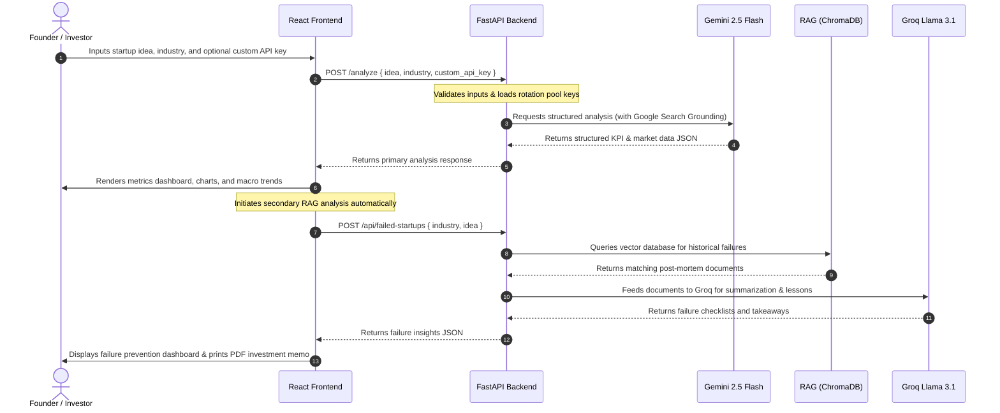

# 🔎 StartupLens: Your Autonomous AI Co-Founder

[](https://fastapi.tiangolo.com/)
[](https://react.dev/)
[](https://www.docker.com/)

**StartupLens** is a premium, AI-powered market intelligence platform designed to validate business concepts, compute financials, detect strategic threats, and cross-reference new ideas with historical failed startup cases using **Retrieval-Augmented Generation (RAG)**.

By deploying autonomous AI agents, StartupLens turns raw ideas into data-driven strategic investment memos in seconds, saving founders from the expensive validation phases of early business development.

---

## 📌 System Architecture

The following diagram illustrates the flow of data, APIs, and execution boundaries between the presentation, backend logic, and model orchestration layers:


<details>
<summary>📐 View Diagram Source (Mermaid.js)</summary>

```mermaid
graph TD
    %% Colors and Styles
    classDef client fill:#ececff,stroke:#9370db,stroke-width:2px;
    classDef presentation fill:#e1f5fe,stroke:#03a9f4,stroke-width:2px;
    classDef application fill:#e8f5e9,stroke:#4caf50,stroke-width:2px;
    classDef processing fill:#fff3e0,stroke:#ff9800,stroke-width:2px;
    classDef data fill:#ffebee,stroke:#f44336,stroke-width:2px;
    classDef external fill:#f3e5f5,stroke:#9c27b0,stroke-width:2px;

    subgraph ClientLayer [Client Layer]
        User([Web Browser User])
    end
    class User ClientLayer client;

    subgraph PresentationLayer [Presentation Layer: React SPA]
        Vite[Vite React Frontend]
        Pages[Pages: LandingPage, Dashboard]
        Components[UI Components: Metrics Cards, Recharts, Modals, PDF Exporter]
        FetchClient[API Client: Fetch]
    end
    class Vite,Pages,Components,FetchClient PresentationLayer presentation;

    subgraph ApplicationLayer [Application Layer: FastAPI Backend]
        Router[API Routes: /analyze, /api/failed-startups]
        Validator[Request Validation & Parsing]
        KeyMgr[API Key Rotation Manager]
        AgentOrch[Agent Orchestration Flow]
    end
    class Router,Validator,KeyMgr,AgentOrch ApplicationLayer application;

    subgraph ProcessingLayer [AI & Processing Agents]
        MasterAgent[Master Analyst Agent - Gemini]
        RAGEngine[RAG Vector Retriever]
        FailureAgent[Failure Analyst Agent - Groq LLM]
    end
    class MasterAgent,RAGEngine,FailureAgent ProcessingLayer processing;

    subgraph DataLayer [Data Layer]
        VectorDB[(ChromaDB Vector Store)]
        CSVData[(Failed Startups Dataset)]
        LocalStorage[(Local File Storage: Logs, Config)]
    end
    class VectorDB,CSVData,LocalStorage DataLayer data;

    subgraph ExternalServices [External Third-Party APIs]
        GeminiAPI[[Google Gemini 2.5 Flash API]]
        SearchGrounding[[Google Search Grounding]]
        GroqAPI[[Groq Llama 3.1 8B API]]
        EmbedModel[[SentenceTransformers: all-MiniLM-L6-v2]]
    end
    class GeminiAPI,SearchGrounding,GroqAPI,EmbedModel ExternalServices external;

    %% Link Flow
    User -->|Interacts with UI| Vite
    Vite --> Pages
    Pages --> Components
    Components -->|Sends Payload| FetchClient

    FetchClient -->|HTTP POST Request| Router
    Router --> Validator
    Validator --> KeyMgr
    KeyMgr --> AgentOrch

    AgentOrch -->|Triggers Main Analysis| MasterAgent
    AgentOrch -->|Triggers Failed Startups Query| RAGEngine
    RAGEngine -->|Generates Embeddings| EmbedModel
    RAGEngine -->|Queries Collections| VectorDB
    VectorDB -->|Retrieves Matches| RAGEngine

    RAGEngine -->|Feeds Documents| FailureAgent
    FailureAgent -->|Summarizes Insights| AgentOrch

    MasterAgent -->|Runs Prompts| GeminiAPI
    GeminiAPI -->|Real-time Verification| SearchGrounding
    GeminiAPI -->|Auto Fallback| GroqAPI
    
    AgentOrch -->|Formats Consolidated JSON| Router
    Router -->|JSON Response| FetchClient
```

</details>

---

## 🔄 End-to-End User Flow

StartupLens executes two distinct backend workflows to synthesize comprehensive investment intelligence:


<details>
<summary>📐 View Diagram Source (Mermaid.js)</summary>



</details>

---

## 🌟 Key Features

*   **📊 Dynamic Viability Score**: Evaluates any startup idea on a scale of 0-100 based on market density, barriers to entry, and timing.
*   **🌐 Grounded Web Research**: Leverages Google Search grounding tools inside the LLM context to analyze live competitors, market share, and key trends.
*   **💀 Failed Startups RAG Engine**: Instantly queries an internal vector database (ChromaDB) of real-world startup failures using keyword-vector similarity matching. Shows founders what failed in their exact space and how to avoid the same fate.
*   **⚖️ Trust & Methodology Panel**: Includes a high-contrast explanation modal breaking down the mathematical logic, average multipliers, and risk scoring used by the model.
*   **💳 Demo Pricing Modal**: A built-in subscription model mockup representing premium tiers.
*   **🖨️ PDF investment Memos**: Print-friendly layouts styled with high-contrast text and clean graphics for seamless report downloads.
*   **🔑 API Key Auto-Shifting**: Supports hot-reloading keys from `.env` on-the-fly and automatically shifts between a list of multiple Gemini API keys if one hits rate limits, with a final fallback to Groq (`llama-3.1-8b-instant`).

---

## 🛠️ Technology Stack

*   **Frontend**: React (Vite), TypeScript, Tailwind CSS, Recharts, Lucide Icons.
*   **Backend**: Python, FastAPI, Pydantic, Uvicorn.
*   **RAG / Database**: ChromaDB, LangChain, SentenceTransformers (`all-MiniLM-L6-v2` embeddings).
*   **AI Models**: Google Gemini 2.5 Flash (primary reasoning & grounded search), Groq Llama 3.1 8B (fallback model & fast summarization).

---

## 📁 Repository Structure

```
StartupLens/
├── data/                    # Contains historical failed startup datasets & ingestion sources
├── frontend/                # React SPA source code
│   ├── src/                 # Components, pages, assets, Hooks, state management
│   ├── tailwind.config.js   # Custom Tailwind and theme system
│   └── package.json         # Frontend Node dependencies
├── src/                     # FastAPI Backend source code
│   ├── agents/              # AI Agents logic (grounding, orchestration)
│   ├── rag/                 # Vector ingestion and retriever pipelines
│   ├── server.py            # API routes and key rotation logic
│   └── main.py              # Application entrypoint
├── Dockerfile               # Backend Docker configuration
├── API_DOCS.md              # REST API endpoint details
└── requirements.txt         # Backend Python dependencies
```

---

## 🚀 Local Installation & Run Guide

### 📋 Prerequisites
*   **Node.js**: v18 or later
*   **Python**: v3.10 or later
*   **Google Gemini API Key(s)**: At least one required
*   **Groq API Key**: Optional, for failure analysis RAG speedups

### Step 1: Clone the Repository
```bash
git clone https://github.com/sumithshetty2005/StartupLens.git
cd StartupLens
```

### Step 2: Configure Environment Variables
Create a `.env` file in the root folder:
```env
# Separate multiple Gemini keys with commas for auto-rotation
GOOGLE_API_KEYS=AIzaSyYourFirstKey...,AIzaSyYourSecondKey...
GROQ_API_KEY=gsk_your_groq_api_key_here
PORT=8000
```

### Step 3: Set Up and Run the Backend
From the root directory:
```bash
# Create and activate a virtual environment
python -m venv venv
source venv/bin/activate  # On Windows use: venv\Scripts\activate

# Install dependencies
pip install -r requirements.txt

# Run the Vector DB ingestion script (only needed once to set up RAG)
python -m src.rag.ingestion

# Start FastAPI Server (runs on port 8000)
python src/server.py
```
*You can access the interactive API docs at `http://localhost:8000/docs` once started.*

### Step 4: Set Up and Run the Frontend
In a separate terminal window:
```bash
cd frontend

# Install package dependencies
npm install

# Start Vite React server (runs on port 5173 by default)
npm run dev
```
Open `http://localhost:5173` in your browser.

---

## ⚙️ Advanced System Architecture Details

### 1. RAG Engine & Embedding Pipeline
When a user submits an idea, the backend queries an embedded collection of startup failure stories stored in **ChromaDB**:
*   **Ingestion**: `src/rag/ingestion.py` processes raw CSV/JSON records of startup post-mortems, chunks them, and generates dense vector embeddings using `all-MiniLM-L6-v2`.
*   **Retrieval**: `src/rag/retriever.py` uses similarity search to pull the top 3-5 most contextually relevant failure cases.
*   **Generation**: These failures are injected into a prompt for `Groq Llama 3.1 8B` to extract failure drivers, strategic takeaways, and dynamic checklist recommendations to avoid those issues.

### 2. Multi-Key Auto-Rotation
To combat Gemini API rate limits (`429 Too Many Requests`) during intensive analysis phases:
1. `src/server.py` parses `GOOGLE_API_KEYS` into an array.
2. An internal counter tracks active keys.
3. If an API request throws a rate-limit exception, the server automatically swaps to the next key in the pool and retries.
4. If all Gemini keys fail or are exhausted, it shifts gracefully to the Groq fallback model to ensure maximum availability.
